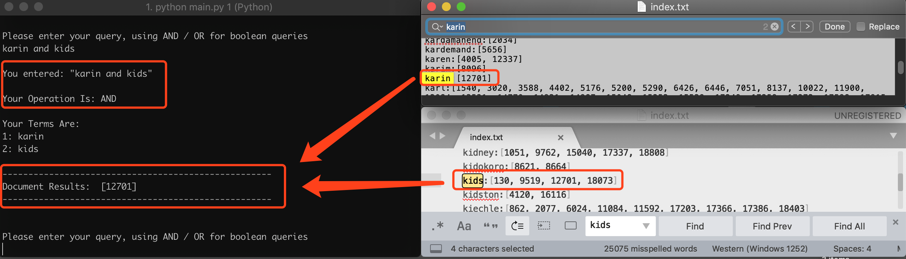
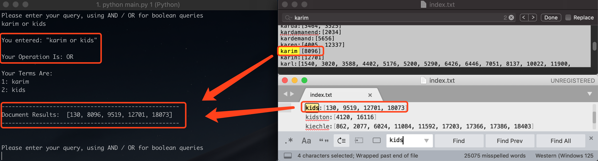

# SPIMI Implementation Report

[toc]

<div style="page-break-after: always"></div>

## 1. Background

In this project, I will implement rudimentary information retrieval using the **SPIMI** algorithm. And then I will do comprehensive tests and analyze resuts.

## 2. Implementation

Unlike **BSBI** (**Blocked Sort-based Indexing**), the **SPIMI**, known as **Single-pass In-memory Indexing**, is more scalable by adding a posting directly to its postings list, especially for vary large data collections.

### 2.1 Techniques

**SPIMI** uses terms instead of termIDs, writes each block's dictionary to disk, and then starts a new dictionary for the next block. SPIMI can index collections of any size as long as there is enough disk space available.

The SPIMI algorithm pseudocode is shown below:

```
SPIMI-INVERT(token_stream)
	output_file = NEWFILE()
	dictionary = NEWHASH()
	while (free memory available)
	do token <- next(tolen_steam)
		if term(token) ∉ dictionary
			then postings_list = ADDTODICTIONARY(dictionary, term(token))
			else postings_list = GETPOSTINGSLIST(dictionary, term(token))
		if full(postings_list)
			then postings_list = DOUBLEPOSTINGSLIST(dictionary, term(token))
		ADDTOPOSTINGSLIST(postings_list, doc_ID(token))
	sorted_terms <- SORTTERMS(dictionary)
	WRITEBLOCKTODISK(sorted_terms, dictionary, output_file)
	return output_file
```

The part of the algorithm that parses documents and turns them into a stream of term-docID pairs, which we call tokens here, has been omitted. SPIMI-INVERT is called repeatedly on the token stream until the entire collection has been processed.

Tokens are processed one by one during each successive call of SPIMI-INVERT. When a term occurs for the first time, it is added to the dictionary (best implemented as a hash), and a new postings list is created.

### 2.2 Implementation

I will implement the project by following four steps:

1. Fetching Documents (**reuters.py**)
2. Preprocessing Documents (**preprocess.py**)
3. Performing SPIMI (**spimi.py**)
4. Doing Query (**query.py**)

#### 2.2.1 Fetching

This is the module responsible for extracting all of the documents from the corpus. It parses line by line for the <REUTERS> tag, extracts the NEWID attribute, the takes all the content between the following <BODY></BODY> tags. The module returns a collection of documents to the main module for the next step.

```python
#Iterate each line
				for line in file:
					count += 1
					if bodyIsOpen:
						#Look for the end of body tag
						lastLineInBody = line.find(self.BODY_END_TAG)
						if lastLineInBody != -1:
							body += line[ : lastLineInBody]
							documents[currentReutersID] = body
							body = ""
							bodyIsOpen = False
							currentReutersID = -1
						else:
							body += line
					else:
						#Look for the beginning of reuters tag
						reuterStart = line.find(self.REUTERS_START_TAG)
						if reuterStart != -1:
							#Get NEWID attribute
							currentReutersID = int(re.search("NEWID=\"(\d*)", line).group(1))
						#Look for the beginning of body tag
						bodyStart = line.find(self.BODY_START_TAG)
						if bodyStart != -1:
							bodyIsOpen = True
							firstLineInBody = line[bodyStart + len(self.BODY_START_TAG) : ]
							lastLineInBody = firstLineInBody.find(self.BODY_END_TAG)
							if lastLineInBody != -1:
								body = firstLineInBody[ : lastLineInBody]
								documents[currentReutersID] = body
								bodyIsOpen = False
								body = ""
								currentReutersID = -1
							else:
								body += firstLineInBody
```

#### 2.2.2 Preprocessing

In the part, I will first tokenize the document extracted from the last step into the tuple.

```python
for index, documentId in enumerate(documents):
		# Step 1: Tokenize
		tokens = tokenizer.word_tokenize(documents[documentId])	
```

Then I will implement the **Lossy Dictionary Compression** techniques, known as **Normalization**, by removing numbers, blanks, punctuations etc.

```python
# Step 2: Normalize
		normalized = tokens
		normalized = [i.lower() for i in normalized] # lowercase
		normalized = [i for i in normalized if not i in string.digits] # remove numbers
		normalized = [i for i in normalized if not i in string.punctuation] # remove punctuation
		normalized = [i for i in normalized if not i == '``' and not i == "''"] # remove blank words
```

The detailed statistical data is shown below :

<table class="tg">
  <tr>
    <th></th>
    <th colspan="3"> Distinct Terms </th>
    <th colspan="3"> Non Positional Postings</th>
  </tr>
  <tr>
    <td></td>
    <td> number </td>
    <td> Δ% </td>
    <td> T% </td>
    <td> number </td>
    <td> Δ% </td>
    <td> T% </td>
  </tr>
  <tr>
    <td> unfiltered </td>
    <td> 78979 </td>
    <td></td>
    <td></td>
    <td> 1590744 </td>
    <td></td>
    <td></td>
  </tr>
  <tr>
    <td> no numbers </td>
    <td> 53001 </td>
    <td> -32.89% </td>
    <td> -32.89% </td>
    <td> 1450855 </td>
    <td> -8.79% </td>
    <td> -8.79% </td>
  </tr>
  <tr>
    <td> 30 stop words </td>
    <td> 52875 </td>
    <td> -0.24% </td>
    <td> -33.13% </td>
    <td> 1116618 </td>
    <td> -23.04% </td>
    <td> -31.83% </td>
  </tr>
  <tr>
    <td> stemming </td>
    <td> 36233 </td>
    <td> -31.47% </td>
    <td> -64.60% </td>
    <td> 1328273 </td>
    <td> 18.96% </td>
    <td> -12.88% </td>
  </tr>
</table>

<div align=center>
<p style="font-size:10px;font-color:#969696">Table 2-1 The detailed statistical data about reuters corpus</p>
</div>

**Table 2-1** above shows the number of terms for different levels of preprocessing (column 2). The number of terms is the main factor in determining the size of the dictionary. The number of non-positional postings (column 3) is an indicator of the expected size of the non-positional index of the collection. The expected size of a positional index is related to the number of positions it must encode (column 4).

In general, the statistics in Table 2-1 show that preprocessing affects the size of the dictionary and the number of non-positional postings greatly. **Stemming** reduces the number of (distinct) terms by **31.47%** and the number of non-positional postings by **18.96%**. The treatment of the most frequent words is also important. The rule of 30 states that the **30 most common words **account for **33.13%** of the tokens in written text. 


#### 2.2.3 SPIMI

The SPIMI algorithm is implemented here. All of the block files are opened, and their top lines are read into an array. The minimum term alphabetically is identified (as well as duplicates in other first lines), postings lists are combined and the (term, postingList) pair are written into the index file.

#### 2.2.4 Query

Here, I will provide the mechanism for processing boolean queries and returning results in the console.

```python
def runQuery(self, keyword):
		# Parse keyword
		terms = self.parseQuery(keyword)
		print '\nYour Terms Are:'
		for i, term in enumerate(terms):
			print str((i + 1)) + ": " + term
		print "" #blank line to skip to next line
		# Collect Postings Lists
		listOfPostingsList = [[]]
		for term in terms:
			if term in self.index:
				listOfPostingsList.append(self.index[term])
		del listOfPostingsList[0] # delete the blank array initializer so as not to mess up intersection calc
		# find intersections
		if listOfPostingsList: # not empty
			if 'or' in keyword.lower():
				results = list(set.union(*map(set, listOfPostingsList)))
			else:
				results = list(set.intersection(*map(set, listOfPostingsList)))
		else: 
			results = []
		print "----------------------------------------------------"
		print "Document Results: ", sorted(results)
		print "----------------------------------------------------\n"
	# Currently, words must be separated by single AND to be parse correctly
	def parseQuery(self, keyword):
		lower = keyword.lower()
		if 'or' in lower:
			return lower.split(' or ')
		else:
			return lower.split(' and ')
```

## 3. Analysis & Test

### 3.1 Scenario 01 - **Single Keyword Query**

1. **Case 1**

	***Purpose:***
	
	Check whether the program can return the correct result when doing a single keyword (**in dictionary**) query.
	
	***Steps:***
	
	1. Open a termianl and go to the project directory.
	2. Run the **main.py** file with the memory size argument. **python main.py 1**
	3. Enter a keyword, like **johns**
	4. Check the result.
	
	***Hypothesis & Analysis:***
	
	The console shows **"Document Results:  [7144, 10890, 21277]"**
	
	***Results:***
	
	<div align=center>

<p style="font-size:10px;font-color:#969696">Figure 3.1 Single Keyword Query (in dictionary) </p>
</div>

2. **Case 2**

	***Purpose:***
	
	Check whether the program can handle the situation and return the correct result when doing a single keyword (**out 0f dictionary**) query.
	
	***Steps:***
	
	1. Open a termianl and go to the project directory.
	2. Run the **main.py** file with the memory size argument. **python main.py 1**
	3. Enter a keyword which is not in the dictionary, like **johnnys**
	4. Check the result.
	
	***Hypothesis & Analysis:***
	
	The console shows **"Your search - " johnnys " - did not match any documents"**
	
	***Results:***
	
	<div align=center>

<p style="font-size:10px;font-color:#969696">Figure 3.2 Single Keyword Query (out of dictionary)</p>
</div>
	
### 3.2 Scenario 02 - **Multiple Keywords Query with "AND"**

1. **Case 1**

	***Purpose:***
	
	Check whether the program can return the correct result when doing a multiple keywords query combined with **AND** returning documents containing all the keywords.
	
	***Steps:***
	1. Open a termianl and go to the project directory.
	2. Run the **main.py** file with the memory size argument. **python main.py 1**
	3. Enter multiple keywords, like **karin and kids**
	4. Check the result.
	
	***Hypothesis & Analysis:***
	
	The console shows **"Document Results:  [12701]"**
	
	***Results:***
	
	<div align=center>

<p style="font-size:10px;font-color:#969696">Figure 3.3 Multiple Keywords Query with "AND" (in dictionary) </p>
</div>

2. **Case 2**

	***Purpose:***
	
	Check whether the program can handle the situation where one or all keywords are not in the dictionary and return the correct result when doing a multiple keywords query combined with **AND** returning documents containing all the keywords.
	
	***Steps:***
	1. Open a termianl and go to the project directory.
	2. Run the **main.py** file with the memory size argument. **python main.py 1**
	3. Enter multiple keywords, like **karins and kids**
	4. Check the result.
	
	***Hypothesis & Analysis:***
	
	The console shows **"Your search - " karins and kids " - did not match any documents"**
	
	***Results:***
	
	<div align=center>

<p style="font-size:10px;font-color:#969696">Figure 3.4 Multiple Keywords Query with "AND" (out of dictionary) </p>
</div>

### 3.3 Scenario 03 - **Multiple Keywords Query with "OR"**

1. **Case 1**

	***Purpose:***
	
	Check whether the program can return the correct result when doing a multiple keywords query combined with **OR** returning documents containing all the keywords.
	
	***Steps:***
	
	1. Open a termianl and go to the project directory.
	2. Run the **main.py** file with the memory size argument. **python main.py 1**
	3. Enter multiple keywords, like **karim or kids**
	4. Check the result.
	
	***Hypothesis & Analysis:***
	
	The console shows **"Document Results:  [130, 8096, 9519, 12701, 18073]"**
	
	***Results:***
	
	<div align=center>

<p style="font-size:10px;font-color:#969696">Figure 3.5 Multiple Keywords Query with "OR" (in dictionary)</p>
</div>

2. **Case 2**

	***Purpose:***
	
	Check whether the program can handle the situation where one or all keywords are not in the dictionary and return the correct result when doing a multiple keywords query combined with **OR** returning documents containing all the keywords.
	
	***Steps:***
	
	1. Open a termianl and go to the project directory.
	2. Run the **main.py** file with the memory size argument. **python main.py 1**
	3. Enter multiple keywords, like **karins or kids**
	4. Check the result.
	
	***Hypothesis & Analysis:***
	
	The console shows **"Document Results:  [130, 9519, 12701, 18073]"**
	
	***Results:***
	
	<div align=center>

<p style="font-size:10px;font-color:#969696">Figure 3.6 Multiple Keywords Query with "OR" (out of dictionary)</p>
</div>

### 3.4 Scenario 04 - Test Queries From Others

1. **Case 1 - From [Viktoriya Malinova](mailto: malinova.vk@gmail.com)**

	***Steps:***
	
	1. Open a termianl and go to the project directory.
	2. Run the **main.py** file with the memory size argument. **python main.py 1**
	3. Enter the keywords **Colombian and imports** given by **Malinova**
	4. Check the result.
	
	***Hypothesis & Analysis:***
	
	The console shows **"Document Results:  [2973, 3048, 12814]"**
	
	***Her Result:***
	
	**[2973, 3048, 12814]**
	
	***My Result:***

	<div align=center>

<p style="font-size:10px;font-color:#969696">Figure 3.7 Test Queries From Viktoriya Malinova</p>
</div>

2. **Case 2 - From [Yongcong Lei]()**

	***Steps:***
	
	1. Open a termianl and go to the project directory.
	2. Run the **main.py** file with the memory size argument. **python main.py 1**
	3. Enter the keywords **China AND Canada AND America** given by **Yongcong Lei**
	4. Check the result.
	
	***Hypothesis & Analysis:***
	
	The console shows **"Document Results:  [14858, 18473]"**
	
	***Her Result:***
	
	**[14858, 18473]**
	
	***My Result:***
	
	<div align=center>

<p style="font-size:10px;font-color:#969696">Figure 3.8 Test Queries From Yongcong Lei</p>
</div>

2. **Case 3 - From [Yongcong Lei]()**

	***Steps:***
	
	1. Open a termianl and go to the project directory.
	2. Run the **main.py** file with the memory size argument. **python main.py 1**
	3. Enter the keywords **Microsoft or Google or Amazon** given by **Yongcong Lei**
	4. Check the result.
	
	***Hypothesis & Analysis:***
	
	The console shows **"Document Results:  [215, 823, 2957, 3027, 5302, 6924, 10829, 12496, 13200, 13611, 17700, 17711, 18026, 19041, 19589]"**
	
	***Her Result:***
	
	**[215, 823, 2957, 3027, 5302, 6924, 10829, 12496, 13200, 13611, 17700, 17711, 18026, 19041, 19589]**
	
	***My Result:***
	
	<div align=center>

<p style="font-size:10px;font-color:#969696">Figure 3.9 Test Queries From Yongcong Lei</p>
</div>

3. **Case 4 - From [Alexander Ross]()**

	***Steps:***
	
	1. Open a termianl and go to the project directory.
	2. Run the **main.py** file with the memory size argument. **python main.py 1**
	3. Enter the keywords **colon or imprudent** given by **Alexander Ross**
	4. Check the result.
	
	***Hypothesis & Analysis:***
	
	The console shows **"Document Results:  [1275, 4983, 8764, 15040, 16077, 16739, 19976]"**
	
	***Her Result:***
	
	**[1275, 4983, 8764, 15040, 16077, 16739, 19976]**
	
	***My Result:***
	
	<div align=center>

<p style="font-size:10px;font-color:#969696">Figure 3.10 Test Queries From Alexander Ross</p>
</div>

### 3.5 Scenario 05 - Test Queries From TA

1. **Case 1 - Jimmy and Carter**

	***Steps:***
	
	1. Open a termianl and go to the project directory.
	2. Run the **main.py** file with the memory size argument. **python main.py 1**
	3. Enter the keywords **Jimmy and Carter**
	4. Check the result.
	
	***Hypothesis & Analysis:***
	
	The console shows **"Document Results:  [12136, 13540, 17023, 18005, 19432, 20614]"**
	
	***My Result:***

	<div align=center>

<p style="font-size:10px;font-color:#969696">Figure 3.11 Test Queries From TA - Jimmy Carter</p>
</div>

2. **Case 2 - Green and Party**

	***Steps:***
	
	1. Open a termianl and go to the project directory.
	2. Run the **main.py** file with the memory size argument. **python main.py 1**
	3. Enter the keywords **Green and Party**
	4. Check the result.
	
	***Hypothesis & Analysis:***
	
	The console shows **"Document Results:  [21577]"**
	
	***My Result:***

	<div align=center>

<p style="font-size:10px;font-color:#969696">Figure 3.12 Test Queries From TA - Green Party</p>
</div>

3. **Case 3 - Innovations and in and telecommunication**

	***Steps:***
	
	1. Open a termianl and go to the project directory.
	2. Run the **main.py** file with the memory size argument. **python main.py 1**
	3. Enter the keywords **Innovations and in and telecommunication**
	4. Check the result.
	
	***Hypothesis & Analysis:***
	
	The console shows **"Your search - " Innovations and in and telecommunication " - did not match any documents"**
	
	***My Result:***
	
	<div align=center>

<p style="font-size:10px;font-color:#969696">Figure 3.13 Test Queries From TA - Innovations in telecommunication</p>
</div>

4. **Case 4 - environmentalist or ecologist**

	***Steps:***
	
	1. Open a termianl and go to the project directory.
	2. Run the **main.py** file with the memory size argument. **python main.py 1**
	3. Enter the keywords **environmentalist or  ecologist**
	4. Check the result.
	
	***Hypothesis & Analysis:***
	
	The console shows **"Document Results:  [5774]"**
	
	***My Result:***

	<div align=center>

<p style="font-size:10px;font-color:#969696">Figure 3.14 Test Queries From TA - environmentalist ecologist</p>
</div>

## 4. Conclusion

As we can seen from above, the **SPIMI** algorithm has two advantages: 

1. It is faster because there is no sorting required.
2. It saves memory because we keep track of the term a postings list belongs to, so the termIDs of postings need not be stored. 

As a result, the blocks that individual calls of SPIMI-INVERT can process are much larger and the index construction process as a whole is more efficient.

In addition to constructing a new dictionary structure for each block and eliminating the expensive sorting step, SPIMI has a third important component: **Compression**. Both the postings and the dictionary terms can be stored compactly on disk if we employ compression. Compression increases the efficiency of the algorithm further because we can process even larger blocks, and because the individual blocks require less space on disk. 

### 4.1 What I've Learned

I’ve deepened my understanding of indexing methodology, SPIMI algorithm and developed a greater appreciation for the technology and techniques behind indexing. I’ve also improved my rusty Python skills and used them to find fast ways to calculate things like the intersection of two postings lists, list comprehensions, etc.

