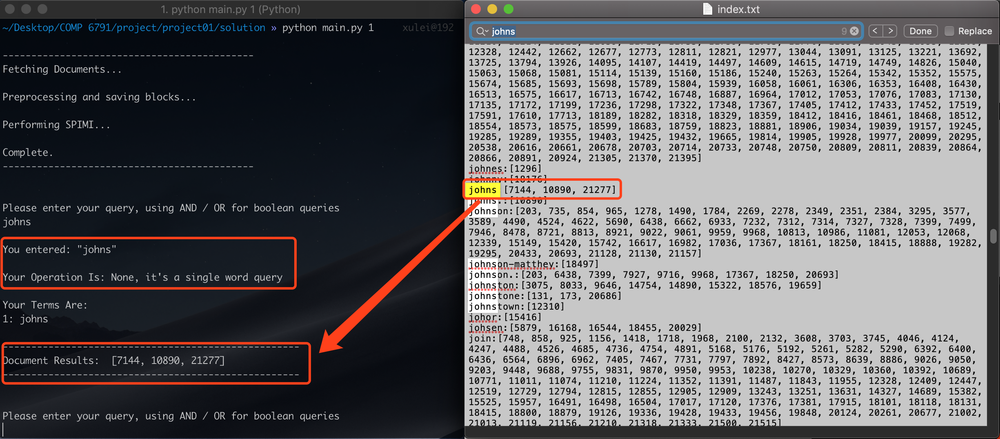
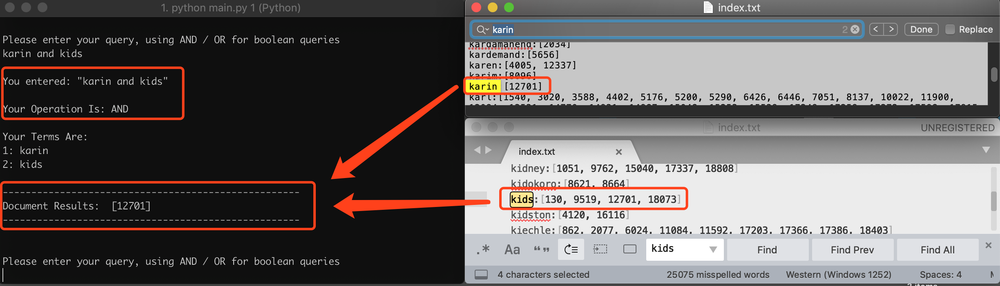
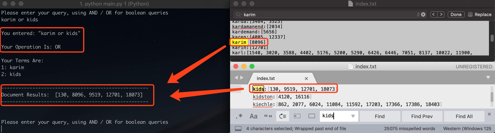

<div align=center>
<p style="font-size:40px"> COMP 6791 - Project 01 </p>
</div>

<div align="center" style="margin: 100px">
<p align="center" style="font-size:15px"> 1. Project Name: SPIMI Algorithm Implementation </p>
<p align="center" style="font-size:15px; margin:30px"> 2. Developer Name: Lei Xu </p>
</div>


<div style="page-break-after: always"></div>

## How to run

The project is implemented by following four steps:

1. Fetching Documents (**reuters.py**)
2. Preprocessing Documents (**preprocess.py**)
3. Performing SPIMI (**spimi.py**)
4. Doing Query (**query.py**)

```
>> python main.py 1

```


<div style="page-break-after: always"></div>

## How to query

### Single Word Query

```
>> johns

```

<div align=center>

<p style="font-size:10px;font-color:#969696">Figure 3.1 Single Keyword Query</p>
</div>

### Multiple Words Query (AND)

```
>> karin and kids

```

<div align=center>

<p style="font-size:10px;font-color:#969696">Figure 3.2 Multiple Keywords Query with "AND"</p>
</div>

### Multiple Words Query (OR)

```
>> karim or kids

```

<div align=center>

<p style="font-size:10px;font-color:#969696">Figure 3.3 Multiple Keywords Query with "OR"</p>
</div>